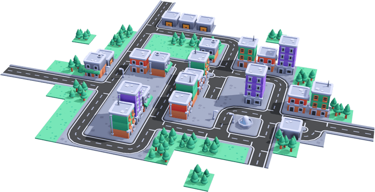
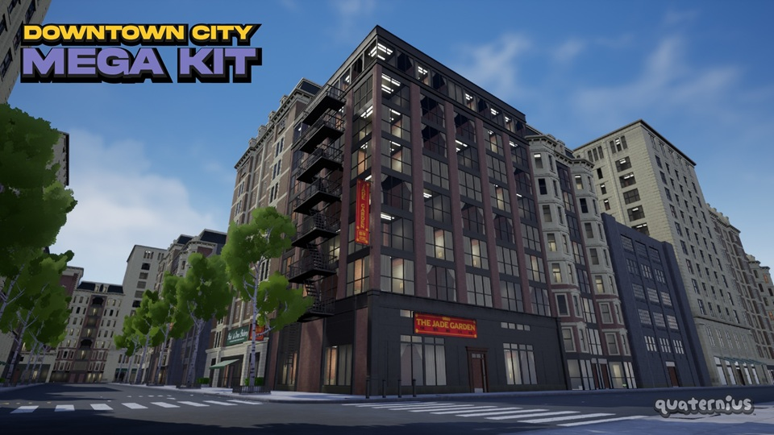
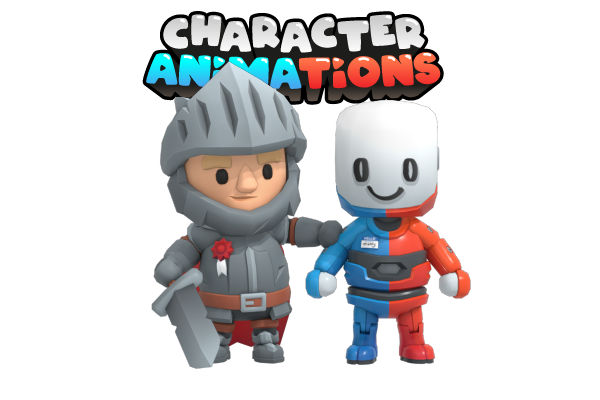
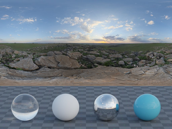
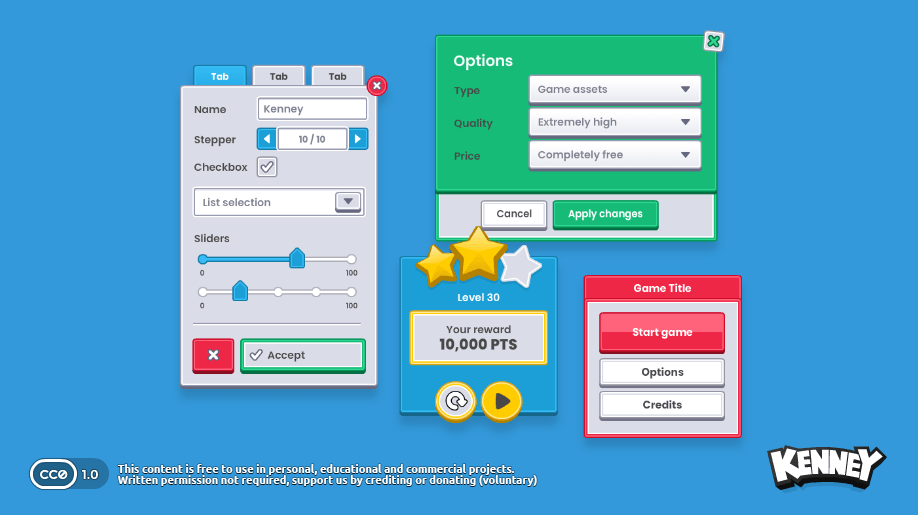
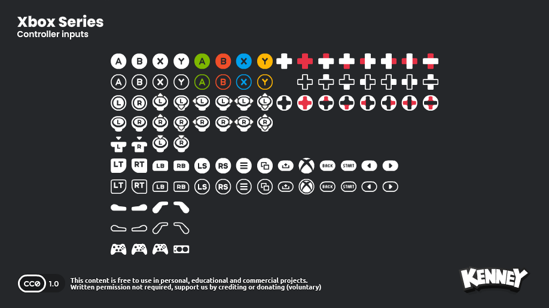
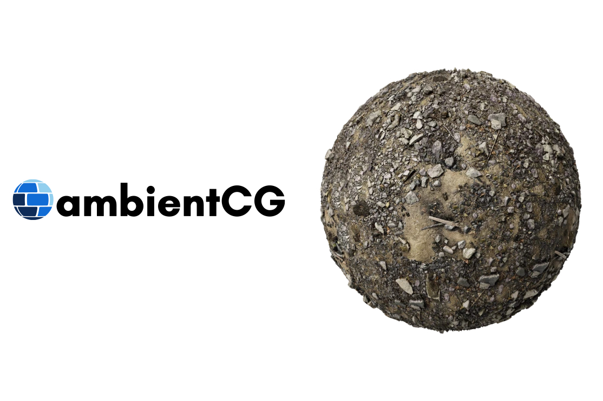
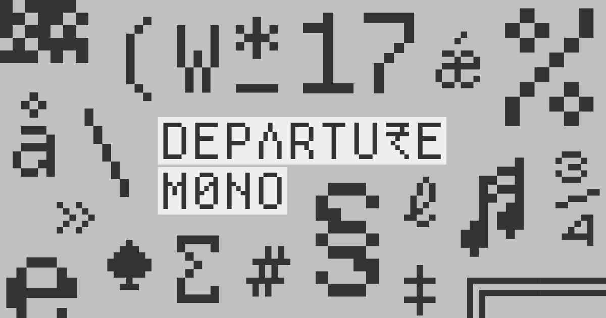

# Free Game Dev Assets

[](https://tmhsdigital.github.io/Free-Game-Dev-Assets/)
[](https://github.com/TMHSDigital/Free-Game-Dev-Assets/actions/workflows/pages.yml)
[](LICENSE)
[](https://tmhsdigital.github.io/Free-Game-Dev-Assets/)
[](https://github.com/TMHSDigital/Free-Game-Dev-Assets/stargazers)
[](CONTRIBUTING.md)

Free assets and tools for commercial games. Each entry records the licence as its source
states it and the date someone read it there; active entries quote the source's own words.
The catalog indexes sources and never rehosts them: check the source before you ship.

- **[Browse 334 sources](https://tmhsdigital.github.io/Free-Game-Dev-Assets/)** on the site, filtered by licence, credit and review status.
- **Starter stacks**, one pick per need and what the whole set owes:
  [2D pixel platformer](https://tmhsdigital.github.io/Free-Game-Dev-Assets/stack/2d-pixel-platformer/) ·
  [2D top-down pixel game](https://tmhsdigital.github.io/Free-Game-Dev-Assets/stack/2d-top-down-pixel/) ·
  [3D low-poly arena in Godot](https://tmhsdigital.github.io/Free-Game-Dev-Assets/stack/3d-low-poly-arena-godot/) ·
  [First-person destruction](https://tmhsdigital.github.io/Free-Game-Dev-Assets/stack/first-person-destruction/) ·
  [Mobile puzzle](https://tmhsdigital.github.io/Free-Game-Dev-Assets/stack/mobile-puzzle/)
- **Licence freshness:** [when each licence was last read at its source](https://tmhsdigital.github.io/Free-Game-Dev-Assets/freshness/), oldest first.
- **By category:** [master index](catalog/README.md) · **Before you ship:** [licences](#licences)

**Recent:** 2026-09-25, starter stacks and a licence freshness page. 2026-09-24, a page for every entry.

## Start here

Choose by the job, not by the licence. Most sources in a category share a licence, so the
licence column rarely tells you which one to pick. These guides compare sources that look
interchangeable and are not. Several are measured from the files themselves, not the store
pages.

| You are choosing | Guide |
| --- | --- |
| A pixel tileset, by grid size and projection | [2D: Choosing a pixel tileset](catalog/2d/README.md#choosing-a-pixel-tileset) |
| An icon set, and which two carry obligations | [2D: Choosing an icon set](catalog/2d/README.md#choosing-an-icon-set) |
| Kenney, KayKit or Quaternius | [3D: measured comparison of scale, triangles and rigs](catalog/3d/README.md#choosing-between-kenney-kaykit-and-quaternius) |
| A PBR texture library you can redistribute | [3D: Choosing a PBR texture source](catalog/3d/README.md#choosing-a-pbr-texture-source) |
| A rigged character, and whether its animations will transfer | [Characters: Choosing a rigged character source](catalog/characters/README.md#choosing-a-rigged-character-source) |
| A pixel font, including CJK | [Fonts: Choosing a pixel font](catalog/fonts/README.md#choosing-a-pixel-font) |
| Game music, and whether videos of your game will get claimed | [Audio: Choosing game music](catalog/audio/README.md#choosing-game-music) |
| Sound effects, and what "no credit" still leaves you owing | [Audio: Choosing sound effects](catalog/audio/README.md#choosing-sound-effects) |
| A Godot 4 add-on that still builds against your engine | [Tools: Godot 4 add-ons](catalog/tools/README.md#godot-4-add-ons) |
| Between two tools that do the same job | [Tools: near-duplicates](catalog/tools/README.md#choosing-between-near-duplicates) |

Need something working today? Take the [safe starting points](#safe-starting-points): the
catalog's highest-confidence sources, with the licence shown so you can see which ones owe
a credit.

## A few of the sources

<table>
  <tr>
    <td align="center" width="25%">
      <a href="catalog/3d/kenney.md"></a><br />
      <b><a href="catalog/3d/kenney.md">Kenney</a></b><br />
      <sub>CC0 · modular 3D</sub>
    </td>
    <td align="center" width="25%">
      <a href="catalog/3d/quaternius.md"></a><br />
      <b><a href="catalog/3d/quaternius.md">Quaternius</a></b><br />
      <sub>CC0 · rigged kits</sub>
    </td>
    <td align="center" width="25%">
      <a href="catalog/3d/kaykit.md"></a><br />
      <b><a href="catalog/3d/kaykit.md">KayKit</a></b><br />
      <sub>CC0 · atlas characters</sub>
    </td>
    <td align="center" width="25%">
      <a href="catalog/environment/poly-haven.md"></a><br />
      <b><a href="catalog/environment/poly-haven.md">Poly Haven</a></b><br />
      <sub>CC0 · HDRI and PBR</sub>
    </td>
  </tr>
  <tr>
    <td align="center" width="25%">
      <a href="catalog/2d/kenney-ui-pack.md"></a><br />
      <b><a href="catalog/2d/kenney-ui-pack.md">Kenney UI</a></b><br />
      <sub>CC0 · HUD and menus</sub>
    </td>
    <td align="center" width="25%">
      <a href="catalog/2d/kenney-input-prompts.md"></a><br />
      <b><a href="catalog/2d/kenney-input-prompts.md">Input prompts</a></b><br />
      <sub>CC0 · 64×64 glyphs</sub>
    </td>
    <td align="center" width="25%">
      <a href="catalog/3d/ambientcg.md"></a><br />
      <b><a href="catalog/3d/ambientcg.md">ambientCG</a></b><br />
      <sub>CC0 · seamless PBR</sub>
    </td>
    <td align="center" width="25%">
      <a href="catalog/fonts/departure-mono.md"></a><br />
      <b><a href="catalog/fonts/departure-mono.md">Departure Mono</a></b><br />
      <sub>SIL OFL · pixel type</sub>
    </td>
  </tr>
</table>

<sub>Publisher promotional stills (CC0 or SIL OFL), shown here as documentation only. The packs themselves stay on the source sites.</sub>

## Browse the catalog

The [website](https://tmhsdigital.github.io/Free-Game-Dev-Assets/) searches all 334 entries
and filters them by category, commercial use, attribution, review status and 2D camera
view. Press `/` to search. Filtered views and individual entries have their own URLs, so you can send
someone exactly what you are looking at.

| Category | Entries | Focus | Index |
| --- | ---: | --- | --- |
| **3D** | 70 | Models, scans, PBR textures and materials | [`catalog/3d/`](catalog/3d/) |
| **Tools** | 77 | Editors, pipeline, TTS, Godot add-ons | [`catalog/tools/`](catalog/tools/) |
| **2D** | 54 | Sprites, tilesets, UI and HUD, icons, palettes | [`catalog/2d/`](catalog/2d/) |
| **Audio** | 30 | SFX, music, foley, impulse responses | [`catalog/audio/`](catalog/audio/) |
| **Characters** | 28 | Rigged packs, generators, modular humanoids | [`catalog/characters/`](catalog/characters/) |
| **Fonts** | 25 | OFL and commercial-ok typefaces, CJK | [`catalog/fonts/`](catalog/fonts/) |
| **Environment** | 13 | HDRI, terrain DEMs, geodata | [`catalog/environment/`](catalog/environment/) |
| **Shaders & VFX** | 17 | Shaders, particle and FX resources | [`catalog/shaders-vfx/`](catalog/shaders-vfx/) |
| **Animation** | 12 | Motion capture and character clips | [`catalog/animation/`](catalog/animation/) |
| **Video** | 8 | Stock footage, archival clips | [`catalog/video/`](catalog/video/) |

## Reading an entry

Each source is one Markdown file: frontmatter for the facts, then notes on what it is good
for, what the catch is, and a dated **Evidence** section quoting the live licence page.

| Status | Meaning |
| --- | --- |
| `active` | Licence read at the source and quoted with a date. Suitable to evaluate for production |
| `needs-review` | Useful, but a real question is still open, and the entry says which. Verify before shipping |
| `deprecated` | Kept for history, with the reason stated. Use an alternative |

`verified` is the date someone last read the licence at the source. The website shows its
age on every row and marks it once it passes a year; at that point, re-read the licence
yourself before you rely on it.

Aggregators (OpenGameArt, Poly Pizza, itch collections, font indexes) are usually `license: varies`.
The licence belongs to each file, not to the site or even to the author, so review every
file you take.

<details>
<summary>Frontmatter fields</summary>

| Field | Meaning |
| --- | --- |
| `license` | Licence as the source states it, from a closed vocabulary in [`site/license-vocabulary.json`](site/license-vocabulary.json) (`CC0`, `CC-BY-4.0`, `SIL OFL`, `GPL-3.0-or-later`, `custom`, `varies`, and so on) |
| `license_spdx` | The SPDX identifier, whenever the licence maps to exactly one. Absent when there is no single identifier: `custom`, `varies`, `unknown`, public domain, unversioned `CC-BY`, and GPL values that do not say `-only` or `-or-later` |
| `commercial` | `true`, `false`, `unknown` or `varies`. `varies` means per-file review; the site's Commercial OK filter still lists these, labelled **per-file review** |
| `attribution_required` | `true`, `false` or `unknown`. For fonts, `false` means no credit line, not no obligation: see [`docs/fonts.md`](docs/fonts.md) |
| `attribution_string` | Copy-paste credit line, present when attribution is required |
| `formats` | Common download and interchange formats |
| `verified` | Date the licence was last read at the source (`YYYY-MM-DD`) |
| `status` | See the table above |
| `publisher` | The rights holder, when it has more than one entry. Never a generic host |
| `grid_dimensions`, `camera_perspective`, `hardware_tags` | Optional 2D metadata: tile size, projection (`top_down`, `isometric_3_4`, `side_scroller`, `2d_flat`), input-device coverage |

Add a new source from [`catalog/TEMPLATE.md`](catalog/TEMPLATE.md). `id` must be unique across the whole catalog.

</details>

## Safe starting points

High-signal sources that cover most early production needs. This mirrors the starter list
on the website, which is set in [`site/config.json`](site/config.json); if the two ever
disagree, the config is the one the site uses.

<details>
<summary>All 19 starters</summary>

| Need | Source | Licence |
| --- | --- | --- |
| Modular low-poly 3D / UI | [Kenney](catalog/3d/kenney.md) | CC0 |
| Rigged low-poly characters | [Quaternius](catalog/3d/quaternius.md) | CC0 |
| Atlas-optimized kits | [KayKit (Kay Lousberg)](catalog/3d/kaykit.md) | CC0 |
| Seamless PBR materials | [ambientCG](catalog/3d/ambientcg.md) | CC0 |
| HDRIs / calibrated env | [Poly Haven](catalog/environment/poly-haven.md) | CC0 |
| Second CC0 HDRI publisher | [Open HDRI](catalog/environment/open-hdri.md) | CC0 |
| Extra PBR + SBSAR | [TextureCan](catalog/3d/texturecan.md) | CC0 |
| UI icons (brand-free) | [Lucide Icons](catalog/2d/lucide-icons.md) | ISC |
| Hand-drawn 2D vectors | [Glitch (CC0 asset release)](catalog/2d/glitch-archive.md) | CC0 |
| Input prompts (Deck / Switch 2 / Quest) | [Kenney Input Prompts](catalog/2d/kenney-input-prompts.md) | CC0 |
| Pro SFX dumps | [Sonniss #GameAudioGDC Bundle](catalog/audio/sonniss-gdc.md) | custom |
| Attribution music | [Incompetech (Kevin MacLeod)](catalog/audio/incompetech.md) | CC-BY-4.0 |
| Pixel / terminal font | [Departure Mono](catalog/fonts/departure-mono.md) | SIL OFL |
| Localization fonts | [Noto Sans (incl. CJK)](catalog/fonts/noto-sans.md) | SIL OFL |
| No-attribution music stingers | [Kenney Music Jingles](catalog/audio/kenney-music-jingles.md) | CC0 |
| No-attribution music loops | [Abstraction Music Loop Bundle](catalog/audio/tallbeard-abstraction-music-loop-bundle.md) | CC0 |
| Generate your own retro SFX | [jsfxr](catalog/tools/jsfxr.md) | Unlicense |
| Extra CC0 PBR (photoscans) | [cgbookcase](catalog/3d/cgbookcase.md) | CC0 |
| CC0 16-bit platformer kit | [SunnyLand (ansimuz)](catalog/2d/ansimuz-sunnyland.md) | CC0 |

</details>

## Licences

Read these before you mix packs into a commercial build.

| Guide | Covers |
| --- | --- |
| [`docs/licenses.md`](docs/licenses.md) | The cheat sheet: what each licence allows and owes |
| [`docs/fonts.md`](docs/fonts.md) | Embedding versus redistribution, and what an OFL font still owes |
| [`docs/geodata.md`](docs/geodata.md) | Attribution across DEM, map and satellite sources, and why ODbL does not reach your game |
| [`docs/game-vs-video-licensing.md`](docs/game-vs-video-licensing.md) | Why "commercial use" on a video licence may not cover a game |
| [`docs/provenance.md`](docs/provenance.md) | Judging a supplier, and keeping a paper trail |
| [`docs/high-risk.md`](docs/high-risk.md) | Sources to avoid entirely |
| [`docs/ai-assets.md`](docs/ai-assets.md) | AI-generated assets |
| [`docs/fivem.md`](docs/fivem.md) | GTA-format and FiveM assets |
| [`docs/trust-score.md`](docs/trust-score.md) | How sources are rated |

<details>
<summary>The short version</summary>

- **CC0**: the safest default for a closed-source game. Nothing owed.
- **CC-BY**: commercial use is fine; credit the author. CC-BY-3.0 sources often want the author named; CC-BY-4.0 is usually met by a credits-screen line.
- **CC-BY-SA**: usable commercially, but share-alike applies to derivatives of the asset. Ship SA files in extractable bundles rather than encrypting them into the binary.
- **Any ND licence**: generally unusable in games, because interactive sync and remix count as derivatives.
- **SIL OFL**: the default for fonts in games. No credit line, but the licence file ships with the font.
- **ODbL (OpenStreetMap)**: a game that renders map data is a produced work, so the share-alike does not reach it. Credit OSM. Redistributing the data itself is what triggers the obligations.
- **Marketplace "free" (Unity, Fab, Unreal)**: often commercial in-engine only, with no redistribution, and sometimes locked to one engine.
- **Aggregators**: the licence is per file, not per author. The same creator's uploads can differ.
- **Trust the supplier**: skip anonymous mega-dumps and known traps (MB-Lab, default Shadertoy, map scrapes, GTA and FiveM rips).

</details>

Catalog metadata in this repository is CC0. Linked assets keep their own licences.

## Godot

A research-backed shortlist for Godot 4 projects is in
[`docs/godot-budget-stack.md`](docs/godot-budget-stack.md). Before adopting an add-on, check
its row in the [maintenance table](catalog/tools/README.md#godot-4-add-ons). Some
add-ons' latest release is years older than their maintained branch, one is alpha, and
one is a Godot 3 runtime listed beside the Godot 4 ones.

## How the catalog stays honest

A catalog like this is only useful if you can trust it, and trust has to be checked, not
asserted. So `node site/validate.mjs` runs on every push and fails the build rather than
publishing a broken catalog. Among other things, it checks that:

- a `verified` date is never newer than the newest date in the entry's own Evidence, so a
  date cannot be bumped without a fresh quote to back it
- every `license` value comes from the documented vocabulary, and its SPDX identifier
  agrees with it
- an attribution licence marked "no attribution" states the publisher's waiver
- category indexes, counts and the badge above match the catalog
- no third-party binaries are committed to the repository

The checks themselves are tested against known-bad fixtures in
[`site/checks.test.mjs`](site/checks.test.mjs). Every review pass, and every correction it
made, is recorded in [`docs/review-ledger.md`](docs/review-ledger.md).

## Scope

**In scope:** free asset libraries, packs and aggregators with a clear free tier; tools for
creating or processing game assets; sources usable in commercial games when their terms
allow.

**Out of scope:** rehosting or mirroring third-party archives, models or audio; paid-only
marketplaces with no meaningful free content; guessing licences. When the source does not
say plainly, the entry says `unknown` and `needs-review` instead.

## Contributing

New sources, licence corrections, dead links and clearer notes are all welcome. See
[`CONTRIBUTING.md`](CONTRIBUTING.md) for the entry checklist and how to verify a licence,
and follow the [Code of Conduct](CODE_OF_CONDUCT.md).

<details>
<summary>Run the checks and preview the site locally</summary>

Node 22 or newer; there is nothing to install.

```bash
npm run check    # all of the below, in the order CI runs them
npm test         # the checks against known-bad fixtures, and the site modules' tests
npm run validate # the catalog, against the checks (node site/validate.mjs)
npm run build    # builds the site into site/dist (node site/build.mjs)
npm run serve    # preview at http://localhost:3000
```

</details>

<details>
<summary>Repository layout</summary>

```text
.
├── README.md
├── CONTRIBUTING.md             how to add and verify an entry
├── LICENSE                     CC0-1.0 for catalog metadata and docs
├── catalog/
│   ├── README.md               master index
│   ├── TEMPLATE.md             copy this to add a source
│   └── 3d/ 2d/ audio/ characters/ environment/
│       fonts/ shaders-vfx/ animation/ video/ tools/
│                               one .md per source, plus a README index
├── docs/
│   ├── licenses.md fonts.md geodata.md game-vs-video-licensing.md
│   ├── provenance.md high-risk.md ai-assets.md fivem.md trust-score.md
│   ├── godot-budget-stack.md research-index.md
│   ├── review-ledger.md        every review pass and what it changed
│   └── images/readme/          publisher stills used in this README
├── stacks/                     starter stacks: one pick per need for a kind of game
├── site/
│   ├── validate.mjs            catalog integrity checks
│   ├── checks.mjs              the checks, as pure functions
│   ├── checks.test.mjs         fixtures proving each check fails on bad input
│   ├── new-entry.mjs           starts an entry from the template
│   ├── sync-counts.mjs         rewrites every restated entry count
│   ├── license-vocabulary.json the licence values the catalog accepts
│   ├── spdx-allowed.json       SPDX identifiers in use
│   ├── build.mjs config.json   static site generator and its settings
│   ├── lib/                    page renderers and shared helpers, with lib.test.mjs
│   └── public/                 page, styles and script
├── package.json                npm scripts only; no dependencies
└── RESEARCH/README.md          research archive index (drafts are gitignored)
```

</details>

## License

Catalog metadata and documentation in this repository are dedicated to the public domain
under [CC0 1.0 Universal](LICENSE). Third-party assets linked from the catalog remain under
their original licences. Verify terms on the source site before use.
